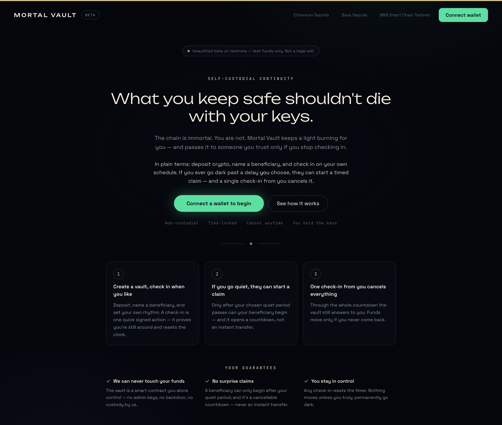
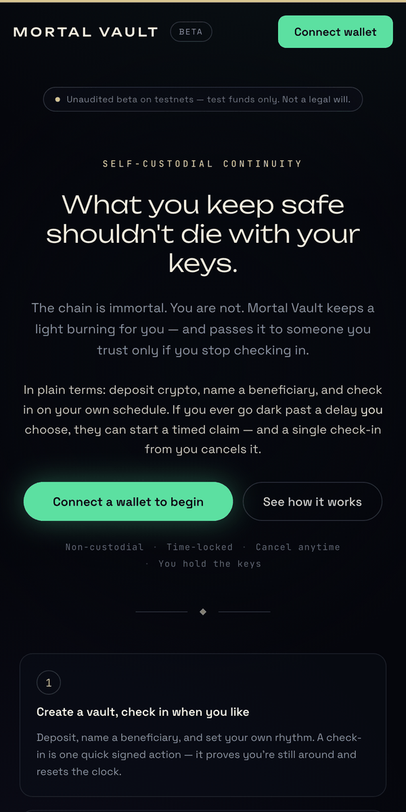

# Mortal Vault

> **These contracts are not audited. Do not put meaningful funds in them.**
> This repository is under active development and is published as engineering
> work, not as a product you should trust with money.

A self-custodial continuity vault for native crypto assets.

The owner keeps control and checks in periodically. If they stop checking in, a
designated beneficiary can start a claim that only matures after a delay, and
the owner can cancel it at any point during that delay simply by proving they
are still active. Nobody but the owner can move funds while the owner is alive
and paying attention, and nothing depends on a third party staying in business.

## The Vigil



The Vigil is the public face of the vault. It explains the trade before it asks
for a wallet, and it puts the unaudited status on the page rather than in a
footnote. Nothing in the interface can move funds on its own: every state change
is a transaction the owner signs.

Two details in there are worth more than the layout. The decorative starfield is
`aria-hidden` and rendered with WebGL, which is a fingerprinting surface that the
privacy-minded people this is built for often switch off and Tor Browser blocks
by default, so `app/components/CosmicScene.tsx` returns without a scene instead
of letting the missing context take the page down. And the network selector
offers testnets only, because there is nothing else honest to offer yet.



## The problem it takes seriously

Inheritance schemes for self-custodied assets usually fail in one of two ways.
Either they require trusting a custodian or an executor, which reintroduces the
counterparty the owner was trying to avoid, or they hand a beneficiary a key
that works immediately, which means the owner has already lost sole control.

This design refuses both. The beneficiary can never act instantly, and the
owner can always veto. The cost is that inheritance is slow by construction:
that is the intended trade.

## What is worth reading

The interesting part is not the happy path, it is the adversarial reasoning
around it.

| Path | Why it is worth opening |
| --- | --- |
| `contracts/contracts/MortalVault.sol` | The state machine. `Claimed` and `Closed` are terminal for this version, deliberately. |
| `contracts/contracts/test/MortalVaultAdversaries.sol` | Attacker contracts written on purpose, so the tests exercise hostile callers rather than only the intended flow. |
| `contracts/contracts/MortalVault.security.t.sol` | Security tests kept separate from lifecycle tests. |
| `contracts/test/MortalVault.lifecycle.spec.ts` | The owner and beneficiary state machine end to end. |
| `docs/threat-model.md` | Scope, assets, and security objectives, with an explicit statement that it is not an independent audit and a list of what is treated as an external dependency. |
| `docs/vault-lifecycle.md` | Every state and transition. |
| `docs/deployment-runbook.md` | The reproducible testnet release and live-chain audit procedure. |
| `docs/monitoring-foundation.md` | The read-only reminder worker boundary and its durable state model. |

Roughly 935 lines of Solidity across the vault, its security tests, and the
adversary contracts.

## Security objectives, stated plainly

Taken from `docs/threat-model.md`:

- Preserve every recorded vault balance until an authorized withdrawal,
  closure, or matured claim succeeds.
- Prevent any caller from spending another owner's recorded balance.
- Prevent a beneficiary from claiming before owner inactivity and the full
  challenge period.
- Let owner activity cancel a pending claim before execution.
- Make `Claimed` and `Closed` terminal for the current vault version.

Chain consensus, wallet software, RPC providers, and the owner's own key
management are external dependencies and are explicitly out of scope.

## Repository

- `contracts/` Solidity contracts, Hardhat deployment modules, and tests
- `app/` The Vigil: the Next.js interface for owners and beneficiaries
- `docs/` product, lifecycle, testing, threat model, and delivery decisions

## Requirements

- Node.js 22.20.0 (see `.nvmrc`)
- npm
- An injected EVM wallet such as MetaMask for browser testing

## Verify locally

```bash
cd contracts
npm ci
npm test

cd ../app
npm ci
npm run lint
npm run build
```

Every address that appears in tests and local configuration is a standard
Hardhat development account. There are no mainnet deployments and no live
contract addresses in this repository, by design.

## Delivery target

The first public beta targets an EVM testnet and a capped, low-cost EVM mainnet
deployment. Ethereum mainnet and Starknet mainnet are post-audit milestones.
Starknet needs a separate Cairo implementation and is tracked as an independent
port, not as a Solidity deployment.

See [docs/revival-roadmap.md](docs/revival-roadmap.md) for scope and release
gates, and [docs/open-questions.md](docs/open-questions.md) for what is still
undecided.

## Status

Pre-audit. No release has been cut, no mainnet contract is deployed, and the
capped mainnet step is gated behind an audit. Treat everything here as work in
progress.

## About

Built by [Mehmet E. Mayda](https://maydalabs.com/profile) at
[MaydaLabs](https://maydalabs.com).
[Read the work-in-progress case study](https://maydalabs.com/case-studies/mortal-vault).

## License

Released under the [MIT License](LICENSE). The license grants permission to use
the code; it does not make the contracts safe. See the warning at the top.
